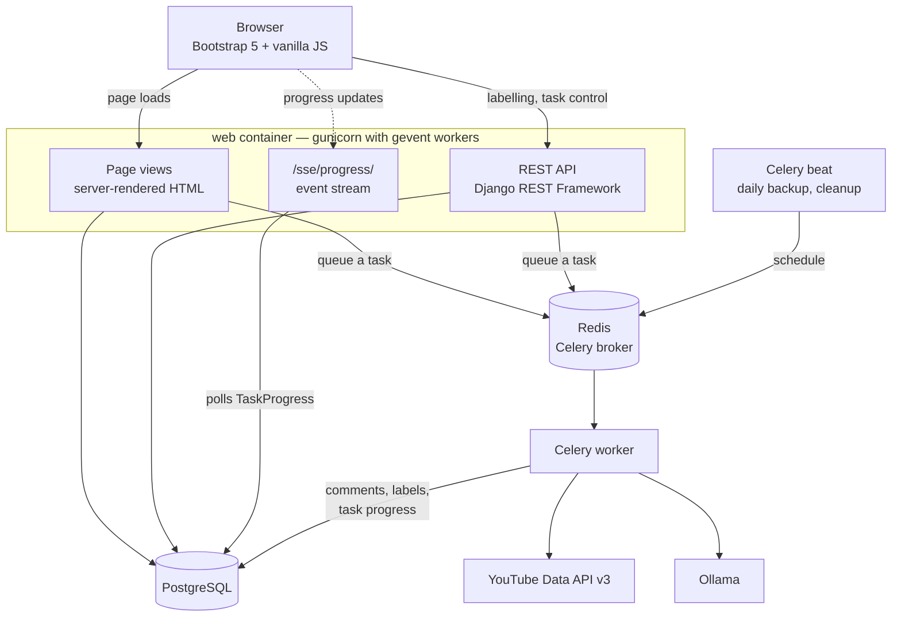

# AnnotaHub

AnnotaHub is a web platform for building annotated Vietnamese text datasets. It
collects comments from YouTube videos, runs them through an LLM for a first pass
of labelling, and then lets a team of human annotators correct and confirm those
labels at both the sentence and the token level.

It was built for Vietnamese NLP research, where the bottleneck is rarely the
model and almost always the lack of labelled data.

**Live demo:** <https://annotahub.duthu.net/> — sign in as `vudinhhong` /
`demo@123` to look around.

## Contents

- [What it does](#what-it-does)
- [Architecture](#architecture)
- [Getting started](#getting-started)
- [Annotating a dataset](#annotating-a-dataset)
- [Export formats](#export-formats)
- [Data model](#data-model)
- [API reference](#api-reference)
- [Development](#development)
- [Known limitations](#known-limitations)
- [License and contact](#license-and-contact)

## What it does

- Fetches comments and replies from a YouTube video, or imports them from a CSV
  file if your data comes from somewhere else.
- Asks an Ollama-hosted LLM to propose a label for each comment and for the
  spans inside it. The model's output is a starting point, never the final word.
- Gives annotators a keyboard-driven workspace to confirm or replace those
  labels, one comment per screen.
- Routes the same comment to several annotators when you want redundancy, then
  measures how much they agree and queues up the disagreements for the project
  owner to settle.
- Exports the result in 16 formats, from CoNLL-2003 to a HuggingFace-ready JSONL
  to an Excel workbook for reviewers who do not use developer tooling.

We use Ollama rather than a hosted API because Vietnamese comment data is often
scraped from public but sensitive discussions, and keeping it on hardware we
control avoids a whole category of questions. Each user can point at their own
Ollama instance from the settings page.

## Architecture



The pages and the API live in the same process and share the same permission
checks; the split in the diagram is about what the browser asks for, not about
where the code runs. Server-rendered templates deliver the initial page, and
from there the JavaScript talks to the REST API for everything interactive —
applying a label, adjudicating a conflict, starting or stopping a task.

Nothing slow happens in a request. Fetching comments, calling the LLM, and
writing an export are all Celery tasks. The worker records how far along it is
in the `TaskProgress` table, and the browser holds open an SSE connection that
polls that table and streams changes back, so the progress bar moves without
anyone refreshing the page.

| Component | Choice |
|---|---|
| Framework | Django 4.2, Django REST Framework |
| Database | PostgreSQL 15 |
| Task queue | Celery with a Redis broker |
| Comment source | YouTube Data API v3, or CSV import |
| Annotation model | Ollama, configurable per user |
| Server | gunicorn with gevent workers, WhiteNoise for static files |
| Frontend | Bootstrap 5 and vanilla JavaScript |
| Packaging | Docker Compose |
| Languages | English and Vietnamese |

## Getting started

You need Docker with Compose, a YouTube Data API v3 key, and an Ollama endpoint
if you want AI pre-annotation.

```bash
git clone https://github.com/vdhong/AnnotaHub.git
cd AnnotaHub
cp .env.example .env
```

Open `.env` and fill in at least:

| Variable | Purpose |
|---|---|
| `SECRET_KEY` | Django signing key. The app refuses to start if you leave the sample value. |
| `YOUTUBE_API_KEY` | Default key for fetching comments; users can override it in their own settings. |
| `OLLAMA_BASE_URL` | Where your Ollama instance lives. |
| `OLLAMA_API_KEY` | Auth token for that instance, if it needs one. |
| `OLLAMA_MODEL` | Model used for annotation, e.g. `qwen3.6:27b`. |
| `SITE_URL` | Public base URL, used to build verification and invitation links. |
| Database and Redis | Connection settings for the bundled containers. |
| SMTP settings | Needed for email verification and invitations. |

Then bring the stack up:

```bash
docker compose up -d
```

Compose starts six services: `db`, `redis`, a one-shot `migrate` job that runs
migrations before anything else touches the database, `web`, `celery_worker`,
and `celery_beat` for scheduled backups and cleanup.

Create an administrator account:

```bash
docker compose exec web python manage.py createsuperuser
```

The application is published on **<http://localhost:6868>** and the Django admin
sits at `/admin`. PostgreSQL and Redis are not exposed to the host.

### Backup and restore

```bash
# Write a timestamped .sql dump into backups/
docker compose exec web python manage.py db_command backup

# Load one back in
docker compose exec web python manage.py db_command restore backups/<file>.sql
```

Pass `--clean-db` to `restore` to drop and recreate the database first, and
`--output-dir` to `backup` if you want the dump somewhere other than
`/app/backups`. Celery beat also takes a dump once a day on its own.

## Annotating a dataset

**Set up your API keys.** Under *User Settings*, enter your own YouTube key and
Ollama endpoint. These take priority over the values in `.env`, so several
people can share one deployment without sharing a quota. API keys are encrypted
before they are stored.

**Define labels, then attach them to a project.** Labels belong to you and can
be reused across projects, where you may override the name, description, or
colour for that project's purposes. A label that is currently applied to a
comment or token cannot be deleted.

**Add a data source.** Paste a YouTube URL and AnnotaHub validates it, pulls the
video metadata, then queues two background tasks: one to fetch the comments and
their replies, another to run the AI pass once fetching finishes. You can stop
either task, retry a failed fetch, continue annotating only what was missed, or
clear everything and start over. If your data is not from YouTube, import a CSV
instead.

**Annotate.** The workspace shows one comment at a time. Keys `1`–`9` apply a
label, `0` clears it, `S` skips a comment with no usable content, the arrow keys
move between comments, and `Ctrl+Z` undoes. Drag across several words to label a
whole phrase rather than clicking word by word. When the queue is set to active
learning, comments the model was least confident about come first.

**Review.** Set `annotators_per_comment` above 1 and each comment waits for that
many independent annotations before its label is settled. The quality page
reports Krippendorff's alpha, pairwise Cohen's kappa, raw agreement, and
per-annotator throughput. Comments where annotators disagreed go to the
adjudication queue for the project owner. With `auto_adjudicate` on, a clear
majority settles the label automatically but the comment stays flagged so you
know there was an argument.

**Export.** Pick a format and a review scope, and the file streams straight to
your browser. Exports are recorded, and you can also freeze a dataset version,
which stores a snapshot with a SHA-256 checksum and the agreement figures that
applied at the time.

## Export formats

Sixteen formats, grouped by what you would do with them.

**For training sequence-labelling models**

| Key | File | Notes |
|---|---|---|
| `conll` | `.conll` | CoNLL-2003: token, tab, BIO tag, blank line between sentences. Read by spaCy, Flair, HuggingFace, and CRFsuite. |
| `conll_full` | `.tsv` | The same plus character offsets and the sentence-level label. |
| `hf_jsonl` | `.jsonl` | `{"tokens": [...], "ner_tags": [...]}` for the `datasets` library. The first line is metadata carrying `label_names`. |
| `spacy_json` | `.json` | spaCy's `[[text, {"entities": [[start, end, label]]}]]`. |

**For moving data between annotation tools**

| Key | File | Notes |
|---|---|---|
| `doccano_jsonl` | `.jsonl` | Import back into Doccano for a second opinion. |
| `label_studio_json` | `.json` | Label Studio pre-annotations. |

**General purpose**

| Key | File | Notes |
|---|---|---|
| `json_sentence` | `.json` | Sentence-level labels. |
| `json_token` | `.json` | Token-level, with BIO tags and a list of spans. |
| `jsonl` | `.jsonl` | The same, one record per line. |
| `xml` | `.xml` | Tokens, BIO tags, and spans. The old key `xml_conll` still works. |

**Spreadsheets**

| Key | File | Notes |
|---|---|---|
| `csv_sentence` | `.csv` | One row per comment. |
| `csv_token` | `.csv` | One row per token, with `bio` and `span_group` columns. |
| `csv_spans` | `.csv` | Only the labelled phrases. The quickest thing to skim. |
| `csv_annotations` | `.csv` | One row per individual annotation, so you can recompute agreement yourself. |
| `xlsx` | `.xlsx` | Multi-sheet workbook for reviewers who want Excel. |

**For fine-tuning an LLM**

| Key | File | Notes |
|---|---|---|
| `json_llm` | `.jsonl` | Chat `messages` format. |

Every CSV is written with a UTF-8 BOM so Excel renders Vietnamese correctly.

### Choosing a review scope

The `review` parameter decides which comments make it into the file, and it
matters more than the format does.

| Value | Contains | Use for |
|---|---|---|
| `all` | Every comment, including ones nobody has looked at | Backups |
| `labelled` | Anything with an AI or human label | Exploring the data |
| `human` | Only human-applied labels | Measuring how good the AI pass was |
| `gold` | Only settled labels, agreed or adjudicated | Publishing a dataset, training a model |

Exporting `all` as training data teaches the model that "nobody got to this yet"
means the label `O`. The export page warns you in red if you pick that
combination.

### Span boundaries and BIO tags

A flat label per token is not enough information to produce correct BIO tags.
Two adjacent tokens carrying the same label might be one two-word phrase or two
separate one-word phrases, and nothing in the labels themselves tells you which.

AnnotaHub stores a `span_group` identifier on each token. Tokens an annotator
selected together as a phrase share one value; tokens labelled individually
each get their own. The BIO output follows from that rather than from a guess:

```
thằng     B-toxic     first phrase starts
ngu       I-toxic     first phrase continues
này       O
đồ        B-toxic     second phrase starts again, not I-
khốn nạn  I-toxic
```

The field records a human decision, so only human annotation writes to it. The
model returns character spans, those are mapped onto tokens by overlap, and the
span itself is then discarded. Where no `span_group` is set — AI labels, and
data from before the field existed — the exporter joins runs of adjacent tokens
carrying the same label. That loses the boundary between two same-labelled
phrases sitting directly next to each other, which is a distinction the model's
own segmentation was never reliable about anyway.

## Data model

**Core**

| Model | Description |
|---|---|
| `Project` | A collection of data sources with an owner and participants |
| `YouTubeLink` | One data source; the `kind` field distinguishes `youtube`, `csv`, and `manual` |
| `Comment` | A single comment, with its labels and review status |
| `Token` | A word inside a comment |
| `Label` | An annotation category owned by a user |
| `ProjectLabel` | Attaches a label to a project, optionally overriding its display |

**Annotation**

| Model | Description |
|---|---|
| `CommentAnnotation` | One annotator's sentence-level label, unique per `(comment, annotator, source)` |
| `TokenAnnotation` | One annotator's token-level label |
| `AnnotationAssignment` | Which comments are assigned to which annotator |
| `AnnotationEvent` | Append-only audit log of every label change |
| `DatasetVersion` | A snapshot with a SHA-256 checksum and agreement metrics |

**Supporting**

| Model | Description |
|---|---|
| `EmailVerification` | Single-use email verification token |
| `UserInvitation` | Project invitation token |
| `UserSettings` | Per-user API configuration, with keys encrypted at rest |
| `TaskProgress` | Background task state, streamed to the UI over SSE |
| `ExportRecord` | Export history |

### Three layers of labels

Every comment and token carries three label fields, checked in order:

```
effective_label = gold_label or manual_label or ai_label
```

`gold_label` is the settled answer, from consensus or adjudication.
`manual_label` mirrors the most recent human annotation. `ai_label` is the
model's suggestion.

These three columns are denormalised copies kept for query speed. The source of
truth is `CommentAnnotation` and `TokenAnnotation`; `recompute_comment_gold()`
brings the copies back in line after every change.

### Review status

`Project.annotators_per_comment` sets how many people must label a comment
before it can be settled.

| Status | Meaning |
|---|---|
| `pending` | Fewer annotations than required so far |
| `agreed` | Enough annotations and they all match, so `gold_label` is set |
| `conflict` | Enough annotations but they differ; waiting on the owner |
| `adjudicated` | The owner has chosen the final label |

Two smaller distinctions are worth knowing about. `Comment.ai_processed` records
that the model has seen a comment, which is not the same thing as the model
having assigned it a label — without that flag, a comment the model deliberately
left blank looks identical to one it never saw, and gets sent back to the LLM
forever. And `Comment.source_text` holds the text exactly as it arrived and is
never written to; `Comment.text` is the normalised, possibly translated version
used for display and annotation.

## API reference

Every endpoint requires authentication and checks project membership. Requests
for a resource you cannot see return `404` rather than `403`, so the API does not
confirm that a project exists to people who have no business knowing.

### Pages

| Method | Path | Description | Access |
|---|---|---|---|
| GET, POST | `/login/`, `/register/` | Sign in and sign up | Public |
| GET | `/verify-email/<token>/` | Confirm an email address | Public |
| POST | `/resend-verification/` | Send the verification email again | Public |
| GET | `/invite/<token>/` | Accept a project invitation | Public |
| GET | `/projects/` | Your projects | Member |
| GET, POST | `/projects/create/` | Create a project | Authenticated |
| GET | `/projects/<id>/` | Project detail | Member |
| GET, POST | `/projects/<id>/edit/` | Edit a project | Owner |
| POST | `/projects/<id>/delete/` | Delete a project | Owner |
| POST | `/projects/<id>/lock/` | Lock a project against further changes | Owner |
| GET, POST | `/projects/<id>/labels/` | Project label settings | Owner |
| GET, POST | `/projects/<id>/participants/` | Manage participants | Owner |
| GET, POST | `/projects/<id>/import/` | Import comments from CSV | Owner |
| GET, POST | `/projects/<id>/export/` | Export a dataset | Member |
| GET | `/projects/<id>/quality/` | Agreement and throughput | Owner |
| GET | `/projects/<id>/adjudicate/` | Resolve disagreements | Owner |
| GET | `/projects/<id>/versions/` | Dataset versions | Member |
| POST | `/projects/<id>/links/add/` | Add a YouTube source | Owner |
| GET | `/links/<id>/detail/` | Comments, with filters and search | Member |
| GET | `/links/<id>/annotate/` | Keyboard annotation workspace | Member |
| GET, POST | `/labels/` and `/labels/create/` | Your labels | Authenticated |
| GET, POST | `/settings/` | Your API settings | Authenticated |
| GET | `/sse/progress/<link_id>/` | Task progress stream | Member |
| GET | `/health/` | Health check, outside i18n routing | Public |

### Projects and sources

| Method | Path | Description | Access |
|---|---|---|---|
| GET | `/api/projects/` | Your projects | Authenticated |
| POST | `/api/projects/create/` | Create a project | Authenticated |
| GET, PUT, DELETE | `/api/projects/<id>/` | Read, edit, delete | GET member, rest owner |
| GET, POST | `/api/projects/<id>/links/` | List or add data sources | GET member, POST owner |
| GET | `/api/projects/<id>/labels/` | Labels attached to the project | Member |
| GET | `/api/links/<id>/status/` | Task state and label counts | Member |
| GET | `/api/links/<id>/comments/` | Comments, paginated and filterable | Member |
| POST | `/api/links/<id>/export/` | Export; body takes `format`, `review`, `filter` | Member |
| GET | `/api/export-formats/` | Available formats | Authenticated |

### Annotation

| Method | Path | Description | Access |
|---|---|---|---|
| GET | `/api/comments/<id>/tokens/` | Tokens of one comment | Member |
| POST | `/api/comments/<id>/set-comment-labels/` | Label a comment | Member |
| POST | `/api/comments/<id>/set-token-labels/<pos>/` | Label one token | Member |
| POST | `/api/comments/<id>/set-token-span/` | Label a span of tokens | Member |
| POST | `/api/comments/<id>/skip/` | Mark a comment as having no usable content | Member |
| POST | `/api/comments/<id>/accept-ai/` | Accept the model's suggestion as-is | Member |
| GET | `/api/comments/<id>/annotations/` | Who labelled this, and what they chose | Member |
| GET | `/api/links/<id>/queue/` | Your annotation queue | Member |
| GET, POST | `/api/projects/<id>/assign/` | Assign work to annotators | Owner |

### Quality and adjudication

| Method | Path | Description | Access |
|---|---|---|---|
| GET | `/api/projects/<id>/agreement/` | Krippendorff's alpha, Cohen's kappa, raw agreement | Owner |
| GET | `/api/projects/<id>/conflicts/` | Comments with disagreement | Owner |
| POST | `/api/comments/<id>/adjudicate/` | Set the final label | Owner |
| GET | `/api/projects/<id>/progress/` | Annotator throughput | Owner sees all, annotators see their own |

### Tasks and versions

| Method | Path | Description | Access |
|---|---|---|---|
| POST | `/api/links/<id>/stop-fetch/` | Stop fetching comments | Owner |
| POST | `/api/links/<id>/stop-annotate/` | Stop the AI pass | Owner |
| POST | `/api/links/<id>/retry-fetch/` | Retry a failed fetch, keeping existing data | Owner |
| POST | `/api/links/<id>/clear-refetch/` | Delete the comments and fetch again | Owner |
| POST | `/api/links/<id>/continue-annotate/` | Annotate whatever was missed | Owner |
| POST | `/api/links/<id>/reannotate/` | Re-run the AI pass | Owner |
| GET, POST | `/api/projects/<id>/versions/` | Dataset versions | GET member, POST owner |
| GET, POST | `/api/projects/<id>/exports/` | Export jobs | Member |
| GET, POST | `/api/labels/`, `/api/labels/create/` | Your labels | Authenticated |

`reannotate` and `continue-annotate` touch only what the model produced. Human
labels at both the comment and the token level survive, as do the span
groupings an annotator made by dragging across several words. To wipe human
work as well you have to say so explicitly with `{"reset_manual": true}`.

Neither call clears anything up front. Each comment is overwritten as the
worker reaches it, so stopping a run half way leaves the remaining comments
with the labels they already had rather than blank.

## Development

Source layout:

```
annotahub/          Django settings, Celery app, root URLs
comments/           The application
  models.py         All models
  views.py          Page views
  api_views.py      REST API
  tasks.py          Celery tasks: fetching, annotating, exporting, maintenance
  export_service.py The 16 export formats
  permissions.py    Project access rules
  fields.py         Encrypted field for stored API keys
  services/         Business logic, one module per concern:
                    youtube, ollama, tokenization, annotation,
                    agreement, ai_review, versioning, stats
  tests/            Test suite, split by area
  management/commands/db_command.py
templates/comments/ Bootstrap 5 templates
static/             CSS and JavaScript
locale/             English and Vietnamese translations
```

Run the tests:

```bash
docker compose exec web python manage.py test comments --settings=annotahub.settings_test
```

CI runs on every push: ruff for linting, a check that no migration is missing,
the full test suite, `manage.py check --deploy`, and a Docker image build with a
smoke test inside the image.

On the security side, API keys are encrypted with Fernet before they reach the
database, so a SQL dump does not leak them. The app refuses to boot if
`SECRET_KEY` still holds the sample value. Login, registration, and
verification-resend are rate limited. Data reaches JavaScript through
`json_script` and the DOM is built with DOM APIs rather than `innerHTML`. The
`next` parameter on login is validated against open redirects, and the usual
headers — HSTS, secure cookies, `X-Frame-Options`, `nosniff` — are set.

## Known limitations

- Comment collection is bounded by your YouTube Data API quota. A busy video can
  exhaust a day's quota on its own, which is part of why each user brings their
  own key.
- Agreement metrics are computed on sentence-level labels. Token-level agreement
  is not reported yet.
- The quality of the AI pass depends entirely on the model you point Ollama at.
  Treat its output as a draft to correct, not as a second annotator.
- Only PostgreSQL is supported. The backup command shells out to `pg_dump`.

## License and contact

The software is licensed under the Apache License 2.0. The full text is in
[LICENSE](LICENSE), and [NOTICE](NOTICE) carries the copyright line that
redistributions need to keep.

**The licence covers the code, not the data you collect with it.** Comments
pulled from YouTube stay subject to YouTube's terms of service, and they carry
personal data — display names, avatars, channel identifiers — which in Vietnam
falls under Decree 13/2023/ND-CP, and under the GDPR if you publish
internationally. 

Issues and pull requests are welcome at
<https://github.com/vdhong/AnnotaHub>. Contributions are taken under Apache 2.0,
as set out in section 5 of the licence, so there is no separate agreement to
sign. If you are adding an export format, put it in
`comments/export_service.py` and add a test next to the existing ones in
`comments/tests/test_export.py`.

Maintained by Dinh-Hong Vu.